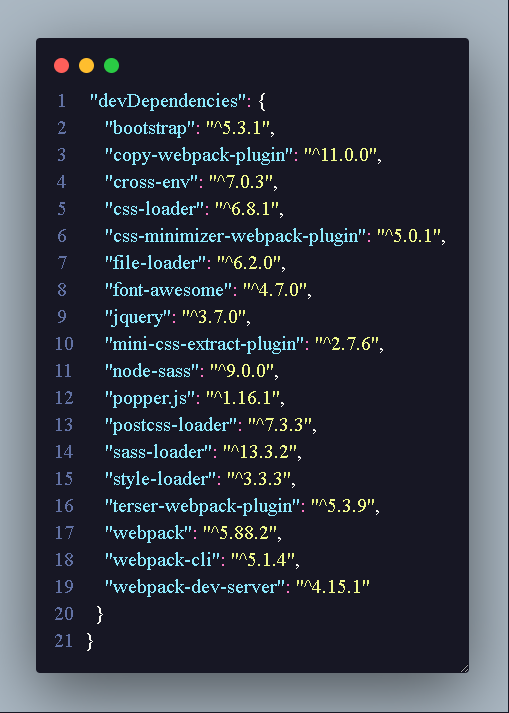
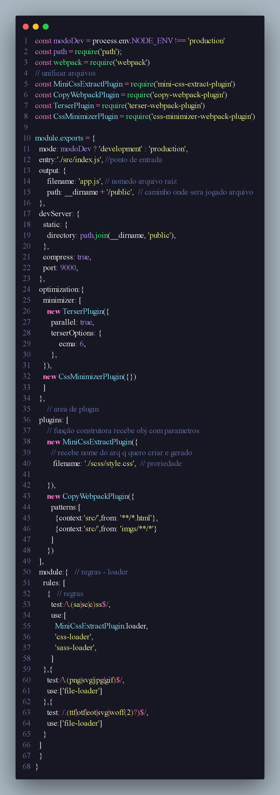

<h1 align="center"> Filtro de Galeria</h1>
 <h3>Projeto contem base e fundamento da junção dos 3 tecnologia junto com front end </h3>
 

 <a href="https://luk3rf7.github.io/filtro_Galeria/"> Filtro Galeria link </a>
</section>

<section style="font-size:18px;">
<h3>Tecnologia utilizada:</h3>

<li>Bootstrap 5
<li>Webpack 5
<li> Html
<li> Sass
<li> javascript
<li> jquery
<section style="font-size:18px;">

</section>
 
<section style="font-size:18px;">
 <h3>Dev dependencies </h3>
 

<h3>Config do Webpack </h3>

configurações basica e utilização de otimização do webpack, webserver

</section>

